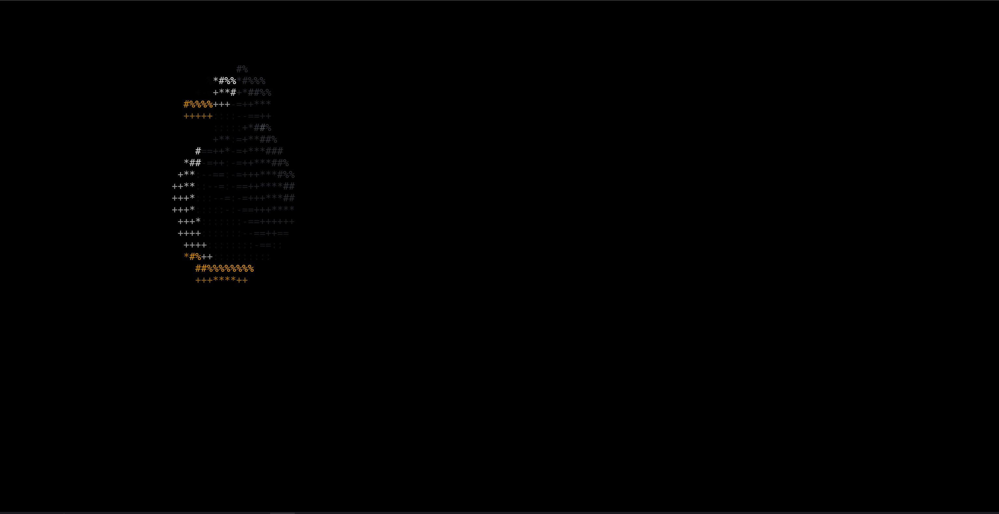

# tux

Un renderizador ASCII con raymarching de Tux (el pingüino de Linux) que corre directamente en tu terminal, escrito en un único archivo C bien denso.



## Qué hace

`tux.c` renderiza un modelo 3D rotando de Tux usando funciones de distancia con signo (SDFs) y sphere tracing (raymarching), y después mapea el resultado a caracteres ASCII con color ANSI de 24 bits (iluminación difusa + brillos especulares) para lograr una animación fluida en la terminal.

- Las partes del cuerpo (panza, espalda, pico, patas, ojos) se construyen a partir de SDFs de elipsoides combinadas en una función de distancia de la escena.
- Las normales de la superficie se estiman por diferencias finitas para la iluminación.
- El loop de renderizado limpia la pantalla, hace raymarching por píxel, e imprime caracteres ASCII coloreados usando secuencias de escape ANSI.
- El modelo rota continuamente (`G` acumula el ángulo de rotación en cada frame).

## Compilar

```sh
gcc -O2 -o tux tux.c -lm
```

## Uso

```sh
./tux
```

Corre indefinidamente hasta que lo interrumpas (Ctrl+C).

Opcionalmente, podés pasar una cantidad de frames para renderizar un número fijo y salir:

```sh
./tux 200
```

## Requisitos

- Una terminal que soporte secuencias de escape ANSI de 24 bits (truecolor).
- `libm` (se linkea con `-lm`).

## Licencia

MIT — ver [LICENSE](LICENSE).
